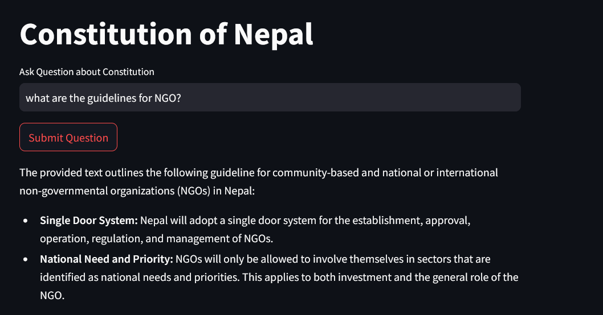
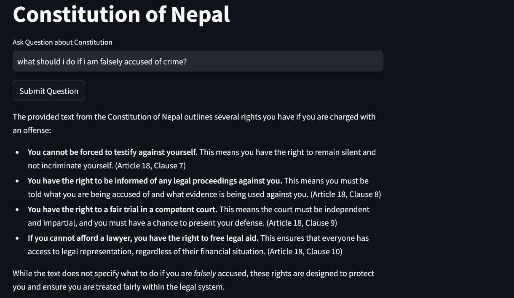

# Constitution of Nepal RAG Application

This project is a Retrieval-Augmented Generation (RAG) application designed to allow users to ask questions about the Constitution of Nepal. The application uses Gemini, and MongoDB to store and retrieve relevant articles or sections from the constitution. It is built using Streamlit for an interactive user interface.





# Overview

The Constitution of Nepal RAG application allows users to ask complex questions about the constitution and receive answers based on a combination of language model reasoning and retrieval of constitution articles from a document store. The application is built to:

    - Retrieve relevant articles from the Constitution of Nepal using MongoDB.

    - Use Gemini for generating detailed and contextually aware answers.

    - Provide a simple, user-friendly interface via Streamlit.

# Features

    - Question Answering: Users can ask questions about any section of the Constitution.

    - Search and Retrieval: Retrieves relevant constitution articles from the database.

    - Augmented Generation: Combines retrieved documents with responses from the Gemini model for comprehensive answers.

    - Interactive Interface: Easy-to-use Streamlit interface for users to interact with the model and database.

# Steps

1. Clone the repository:
    ```bash
    git clone https://github.com/Utkarsha666/MongoDB-GeminiAI-RAG-App-Consititution-of-Nepal-.git
    cd MongoDB-GeminiAI-RAG-App-Consititution-of-Nepal-

2. Set up a virtual environment (optional but recommended):
    ```bash
    python -m venv venv
    source venv/bin/activate  # On Windows use `venv\Scripts\activate`

3. Install dependencies:
    ```bash
    pip install -r requirements.txt

4. Set up MongoDB:
    
    Ensure MongoDB is running on your local machine or cloud.
    notebook/RAG_Constitution_of_Nepal.ipynb to load our dataset into MongoDB

5. Configure environment variables (create a .env file):

    - GEMINI_API_KEY=<your_gemini_api_key>
    - MONGO_URI=<your_mongo_db_uri>

6. Run the Streamlit app:
    ```bash
    streamlit run app.py


Demo App:- https://constitutionofnepal.streamlit.app/